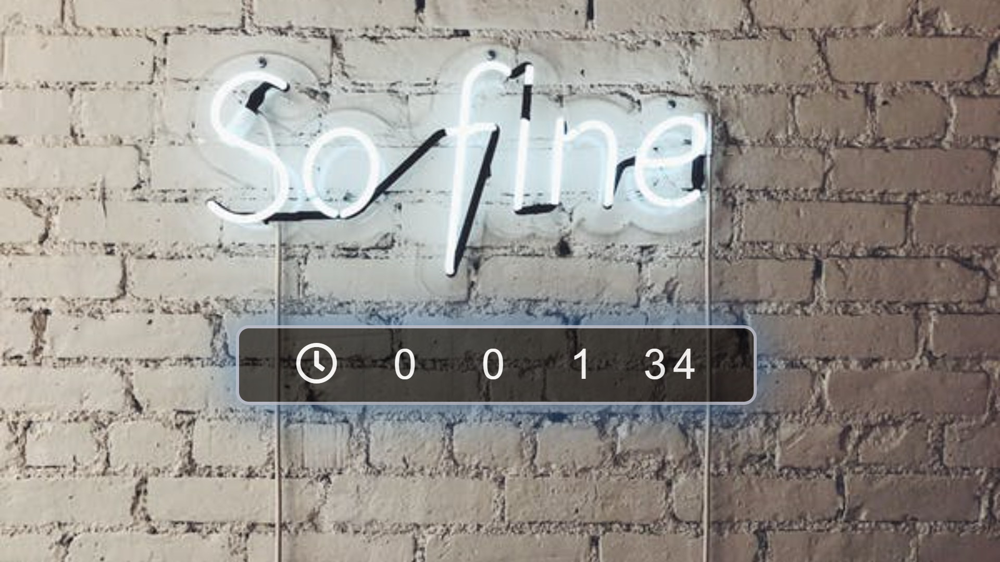

# Simple Counter


### Instrucciones
1) El propósito principal del componente es mostrar cuántos segundos han pasado desde que el sitio web terminó de cargarse (onLoad).
2) Use el ReactDOM.render() para representar el componente en la aplicación web.
Use la función setInterval() para volver a renderizar el componente cada segundo.
3) El componente no necesita un estado local, puede pasar la cantidad de segundos como props .
4) Puede encontrar el ícono del reloj a la izquierda del componente en fuente impresionante.

### Instalación Manual

1) Remember to install the npm packages first:
```
$ npm install
```

2) Build and Start coding!

Build the application for the first time...

```
$ npm run start
```